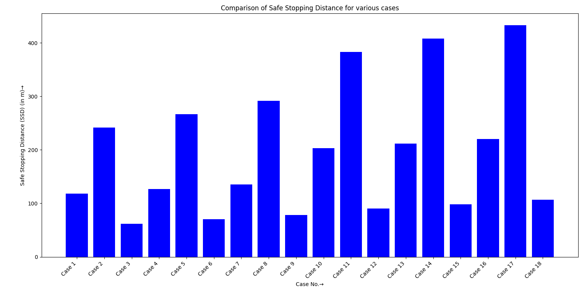

<div align="center">

# 🦺 Traffic Safety Analysis

**A branch of [Traffic Engineering Problems](https://github.com/shreyanspeaking-arch/Traffic-Engineering-Problems), a collection of Python programs for traffic and transportation engineering.**

  

</div>

Programs for predicting crashes and checking that drivers have enough distance to stop safely.

## 📂 Programs in this branch

| # | Program | What it does |
|:-:|---|---|
| 1 | [**Crash Prediction at a Four Leg Signalized Intersection**](#1-crash-prediction-at-a-four-leg-signalized-intersection) | Predicted crashes per year using the HSM method |
| 2 | [**Safe Stopping Distance (SSD)**](#2-safe-stopping-distance-ssd) | Stopping distance between two vehicles across many cases |

## ⚙️ Getting started

```bash
git clone -b Traffic-Safety-Analysis --single-branch https://github.com/shreyanspeaking-arch/Traffic-Engineering-Problems.git
cd Traffic-Engineering-Problems
pip install pandas numpy sympy matplotlib openpyxl
python Traffic_Safety_Analysis_at_a_4_signal_intersection.py
```

Every program is interactive: it asks for its inputs one at a time in the terminal, then prints (and, where noted, saves or plots) the results.

---

## 1. Crash Prediction at a Four Leg Signalized Intersection

📄 **File:** [`Traffic_Safety_Analysis_at_a_4_signal_intersection.py`](./Traffic_Safety_Analysis_at_a_4_signal_intersection.py)

Predicts the annual number of crashes at a four leg signalized intersection, using safety performance functions and crash modification factors consistent with the Highway Safety Manual predictive method.

**How it works**

1. Using the major and minor street traffic volumes and the calibration coefficients of Tables 12-4 and 12-5, the program computes base crash frequencies for multi-vehicle and single-vehicle crashes, split into injury and fatal, and property damage only components.
2. Using the pedestrian volume (or a default from Table 12-7), the maximum number of lanes a pedestrian must cross, and the coefficients of Table 12-6, the program computes a base pedestrian crash frequency.
3. The program applies crash modification factors for turn lanes (Table 12-9) and left turn phasing (Table 12-10). The user also enters the number of approaches prohibiting right turn on red, and either the number or proportion of multi-vehicle crashes that are right angle or rear end collisions, from which the program derives further crash modification factors for right turn on red restrictions and red light cameras.
4. Crash modification factors for nearby schools, bus stops and alcohol selling stores (Table 12-11) are applied to the base pedestrian crash frequency.
5. The program combines the adjusted vehicle, pedestrian, and bicycle crash predictions, applies a user supplied local calibration factor, and reports the total predicted number of crashes per year at the intersection.

**📥 Data files it reads**

| File | Contents |
|---|---|
| [`Table_12_4_Calibration_Coefficients.csv`](./Table_12_4_Calibration_Coefficients.csv) | Calibration coefficients for the multi-vehicle base crash frequency model |
| [`Table_12_5_Calibration_Coefficients.csv`](./Table_12_5_Calibration_Coefficients.csv) | Calibration coefficients for the single-vehicle base crash frequency model |
| [`Table_12_6_Calibration_Coefficients.csv`](./Table_12_6_Calibration_Coefficients.csv) | Calibration coefficients for the base pedestrian crash frequency model |
| [`Table_12_7_Pedestrian_Volume_Default_Values.csv`](./Table_12_7_Pedestrian_Volume_Default_Values.csv) | Default pedestrian volumes when an actual count is not available |
| [`Table_12_8_Crash_Modification_Factors.csv`](./Table_12_8_Crash_Modification_Factors.csv) | Reference only (not read by the program): which crash modification factors apply to each crash type |
| [`Table_12_9_CMF_Turn_Lanes.csv`](./Table_12_9_CMF_Turn_Lanes.csv) | Crash modification factors for exclusive left or right turn lanes |
| [`Table_12_10_CMF_Left_Turn_Phasing.csv`](./Table_12_10_CMF_Left_Turn_Phasing.csv) | Crash modification factors for left turn signal phasing |
| [`Table_12_11_Formatted.csv`](./Table_12_11_Formatted.csv) | Crash modification factors for nearby schools, bus stops and alcohol selling stores |

**🧪 Sample input and output**

| Input | Output |
|---|---|
| Manual input | [`Sample_Input_Output.md`](./Sample_Input_Output.md) |

---

## 2. Safe Stopping Distance (SSD)

📄 **File:** [`Safe_Stopping_Distance_SSD.py`](./Safe_Stopping_Distance_SSD.py)

Computes and compares the Safe Stopping Distance (SSD) between two model vehicles, A and B, across multiple user-defined cases, accounting for reaction time, road grade, coefficient of friction, and relative direction of movement.

**How it works**

1. The user enters the unit of speed (kmph or mph), and for each case, the total reaction plus maneuver time, the speeds of both vehicles, the grade of the highway for each (entered either in degrees or as a percentage, with uphill or downhill direction specified), the coefficient of friction between each vehicle's wheels and the pavement surface, and any head start distance between the two vehicles.
2. The program determines whether the vehicles are moving in the same or opposite directions, either from user input or inferred from their uphill/downhill orientation, and applies the corresponding sign convention when combining their individual stopping distances.
3. The individual stopping distance for each vehicle is computed as the sum of the distance travelled during reaction time and the braking distance derived from its speed, friction coefficient, and grade. These are combined according to the direction of travel and reduced by the head start distance to obtain the Safe Stopping Distance for that case.
4. The user can repeat this for multiple cases within a single session, optionally adding a descriptive statement for each. All case parameters and results are tabulated and exported to an Excel file, and the variation of Safe Stopping Distance across cases is plotted.

**🧪 Sample input and output**

| Input | Output |
|---|---|
| Manual input (see the commit history of the output files) | [`Various_Stopping_Sight_Distance_Conditions.xlsx`](./Various_Stopping_Sight_Distance_Conditions.xlsx)<br>[`Various_Stopping_Sight_Distance_Conditions.png`](./Various_Stopping_Sight_Distance_Conditions.png) |

**📊 Sample graph**

<p align="center">
  
</p>

---

<div align="center"><sub>📚 <a href="https://github.com/shreyanspeaking-arch/Traffic-Engineering-Problems">Back to all topics</a></sub></div>
