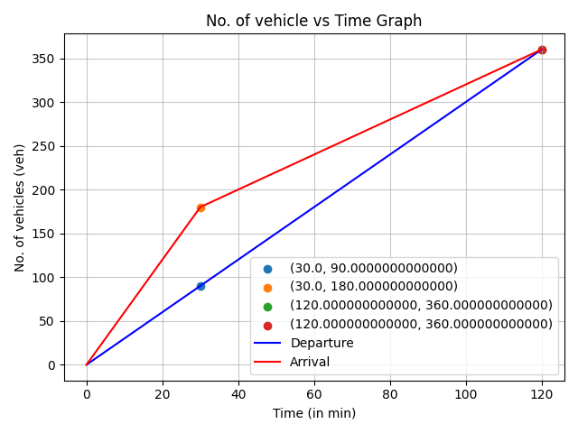

<div align="center">

# ⏳ Queuing Analysis

**A branch of [Traffic Engineering Problems](https://github.com/shreyanspeaking-arch/Traffic-Engineering-Problems), a collection of Python programs for traffic and transportation engineering.**

  

</div>

Queues form wherever vehicles arrive faster than they can be served: at toll plazas, signals and bottlenecks. Models are named in Kendall's notation, **arrivals / service / number of servers**, where **D** means deterministic (fixed) and **M** means random (Poisson arrivals or exponential service).

## 📂 Programs in this branch

| # | Program | What it does |
|:-:|---|---|
| 1 | [**D/D/1 Queuing Model**](#1-dd1-queuing-model) | Delay, queue length and dissipation time with cumulative curves |
| 2 | [**Deterministic Queuing Analysis over Time Intervals**](#2-deterministic-queuing-analysis-over-time-intervals) | Queue size interval by interval, from manual input or a file |
| 3 | [**M/D/1 Queuing Model**](#3-md1-queuing-model) | Random arrivals, fixed service, one server |
| 4 | [**M/M/1 Queuing Model**](#4-mm1-queuing-model) | Random arrivals, random service, one server |
| 5 | [**M/M/N Queuing Model**](#5-mmn-queuing-model) | Random arrivals, random service, N servers |

## ⚙️ Getting started

```bash
git clone -b Queuing-Analysis --single-branch https://github.com/shreyanspeaking-arch/Traffic-Engineering-Problems.git
cd Traffic-Engineering-Problems
pip install pandas numpy sympy matplotlib openpyxl
python D_D_1_Queuing_Model.py
```

Every program is interactive: it asks for its inputs one at a time in the terminal, then prints (and, where noted, saves or plots) the results.

---

## 1. D/D/1 Queuing Model

📄 **File:** [`D_D_1_Queuing_Model.py`](./D_D_1_Queuing_Model.py)

Analyzes a deterministic D/D/1 queue at a single service point. It computes queue dissipation time, maximum queue length, total vehicles served, average delay per vehicle, and average queue length, and plots cumulative arrivals and departures against time.

**How it works**

1. The user enters the number of instances at which the departure rate and the arrival rate change, along with the time, and either the average headway or the rate itself, at each change point, plus any vehicles already queued at the start of the study.
2. The program constructs piecewise linear cumulative arrival and departure curves from these rates, with the initial queue reflected as a starting offset in the arrival curve, solves for the time at which the two curves meet to determine when the queue dissipates, and evaluates the queue length at each rate change to find the maximum.
3. The program computes total delay as the area between the arrival and departure curves, derives average delay per vehicle and average queue length from it, and plots both cumulative curves over the full study period.

**🧪 Sample input and output**

| Input | Output |
|---|---|
| Manual input (see the commit history of the graph) | [`Cumulative_No_of_vehicles_stuck_in_a_queue_vs_Time_Graph_for_D_D_1_Queuing_Analysis.png`](./Cumulative_No_of_vehicles_stuck_in_a_queue_vs_Time_Graph_for_D_D_1_Queuing_Analysis.png) |

**📊 Sample graph**

<p align="center">
  
</p>

---

## 2. Deterministic Queuing Analysis over Time Intervals

📄 **File:** [`Deterministic_Queuing_Analysis.py`](./Deterministic_Queuing_Analysis.py)

Analyzes deterministic queue buildup and dissipation over a series of time intervals with varying arrival and departure rates, either entered manually or read from a CSV or Excel file.

**How it works**

1. For each interval, the user provides the arrival and departure rates, either as totals or per lane, along with the number of lanes if applicable, and the program computes the number of vehicles arriving and departing, and the resulting queue size at the end of each interval.
2. If the queue is found to clear before the final recorded interval, the program truncates the analysis at that point. Otherwise, assuming constant rates continue beyond the last recorded interval, the program extrapolates forward to estimate the exact time the queue fully dissipates.
3. The program reports the queue clearance time, exports the interval by interval results to an Excel file, and plots the size of the queue over time from the start of the study through to its dissipation.

**🧪 Sample input and output**

| Input | Output |
|---|---|
| [`scenario_1_same_day_veh_h_ln.csv`](./scenario_1_same_day_veh_h_ln.csv) | [`output6.xlsx`](./output6.xlsx)<br>[`Size of Queue vs End Time 1.png`](./Size%20of%20Queue%20vs%20End%20Time%201.png) |
| [`scenario_2_multiday_arr_veh_h.csv`](./scenario_2_multiday_arr_veh_h.csv) | [`output7.xlsx`](./output7.xlsx)<br>[`Size of Queue vs End Time 2.png`](./Size%20of%20Queue%20vs%20End%20Time%202.png) |
| [`scenario_3_sameday_both_veh_h.csv`](./scenario_3_sameday_both_veh_h.csv) | [`output8.xlsx`](./output8.xlsx)<br>[`Size of Queue vs End Time 3.png`](./Size%20of%20Queue%20vs%20End%20Time%203.png) |

**📊 Sample graphs**

<p align="center">
  
</p>

<p align="center">
  
</p>

<p align="center">
  
</p>

---

## 3. M/D/1 Queuing Model

📄 **File:** [`M_D_1_Queuing_Model.py`](./M_D_1_Queuing_Model.py)

Analyzes an M/D/1 queue: random, Poisson distributed arrivals, deterministic (fixed) service times, and a single server.

**How it works**

1. The user enters the average departure rate, either directly or via the average headway between vehicles, and the average arrival rate.
2. The program computes the utilization ratio as the arrival rate divided by the departure rate, and uses standard M/D/1 queuing formulas to determine the average number of vehicles in queue and the average waiting time per vehicle in queue.
3. The program reports the average queue length and the average waiting time, along with the average total time a vehicle spends in the system, combining waiting time and service time.

---

## 4. M/M/1 Queuing Model

📄 **File:** [`M_M_1_Queuing_Model.py`](./M_M_1_Queuing_Model.py)

Analyzes an M/M/1 queue: random, Poisson distributed arrivals, random, exponentially distributed service times, and a single server.

**How it works**

1. The user enters the average departure rate and average arrival rate, either directly, via average headway, or by providing aggregated counts of departures or arrivals over one or more timed intervals.
2. The program computes the utilization ratio as the arrival rate divided by the departure rate, and uses standard M/M/1 queuing formulas to determine the average number of vehicles in queue, the average waiting time per vehicle in queue, and the average total time a vehicle spends in the system.
3. The user can additionally query the steady state probability of finding any specific number of vehicles in the queuing system, repeated for as many values as desired.

---

## 5. M/M/N Queuing Model

📄 **File:** [`M_M_N_Queuing_Model.py`](./M_M_N_Queuing_Model.py)

Analyzes an M/M/N queue: random, Poisson distributed arrivals, random, exponentially distributed service times, and N parallel service channels.

**How it works**

1. The user enters the average departure rate per channel and average arrival rate, either directly, via average headway, or by providing aggregated counts over one or more timed intervals, along with the number of departure channels.
2. The program computes the offered traffic load and, using standard M/M/N queuing formulas, the probability of an empty system, the probability of all channels being occupied, the average queue length, the average waiting time per vehicle in queue, and the average total time a vehicle spends in the system.
3. The user can additionally query the steady state probability of finding any specific number of vehicles in the queuing system, repeated for as many values as desired.

---

<div align="center"><sub>📚 <a href="https://github.com/shreyanspeaking-arch/Traffic-Engineering-Problems">Back to all topics</a></sub></div>
