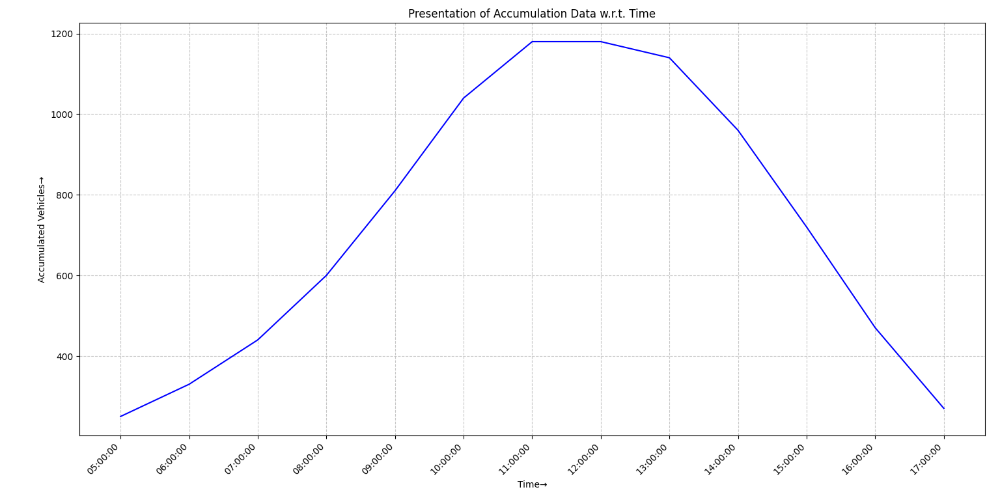
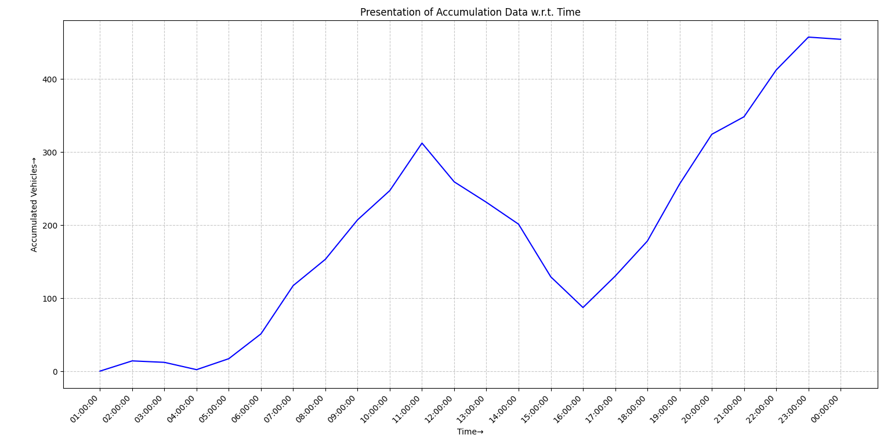

<div align="center">

# 🚧 Cordon Count Study

**A branch of [Traffic Engineering Problems](https://github.com/shreyanspeaking-arch/Traffic-Engineering-Problems), a collection of Python programs for traffic and transportation engineering.**

  

</div>

A cordon count draws an imaginary boundary around an area, such as a city centre, and counts every vehicle crossing it in and out. Comparing the two over time shows how many vehicles are inside the area at any moment, which is called the accumulation.

## 📂 Programs in this branch

| Program | What it does |
|---|---|
| [**Vehicle Accumulation in a Cordon Area**](#vehicle-accumulation-in-a-cordon-area) | Accumulation of vehicles inside a cordon over time, with a plot |

## ⚙️ Getting started

```bash
git clone -b Cordon-Count-Study --single-branch https://github.com/shreyanspeaking-arch/Traffic-Engineering-Problems.git
cd Traffic-Engineering-Problems
pip install pandas numpy matplotlib openpyxl
python Accumulation_Computations_for_an_Illustrative_Cordon_Study.py
```

Every program is interactive: it asks for its inputs one at a time in the terminal, then prints (and, where noted, saves or plots) the results.

---

## Vehicle Accumulation in a Cordon Area

📄 **File:** [`Accumulation_Computations_for_an_Illustrative_Cordon_Study.py`](./Accumulation_Computations_for_an_Illustrative_Cordon_Study.py)

Computes and plots the accumulation of vehicles within a cordon area over time, based on vehicles entering and leaving at the cordon boundary.

**How it works**

1. The user first enters a known starting accumulation value, observed over an initial time interval.
2. For each subsequent time interval, either at a fixed interval length matching the first, or with individually specified start and end times, the user enters the number of vehicles entering and leaving the cordon.
3. The accumulation for each interval is computed as the previous interval's accumulation plus vehicles entering minus vehicles leaving in the current interval. The resulting accumulation data is printed as a table and plotted against time.

**🧪 Sample input and output**

| Input | Output |
|---|---|
| [`accumulation_computations_24hr.csv`](./accumulation_computations_24hr.csv) | [`output9.xlsx`](./output9.xlsx)<br>[`Accumulation_of_Vehicles_wrt_time_1.png`](./Accumulation_of_Vehicles_wrt_time_1.png) |
| [`traffic_simulation_24h.csv`](./traffic_simulation_24h.csv) | [`output10.xlsx`](./output10.xlsx)<br>[`Accumulation_of_Vehicles_wrt_time_2.png`](./Accumulation_of_Vehicles_wrt_time_2.png) |

**📊 Sample graphs**

<p align="center">
  
</p>

<p align="center">
  
</p>

---

<div align="center"><sub>📚 <a href="https://github.com/shreyanspeaking-arch/Traffic-Engineering-Problems">Back to all topics</a></sub></div>
